# Zombie Rampage
Welcome to Zombie Rampage, a thrilling top-down shooter game built in Java. Engage in an adrenaline-pumping battle against hordes of relentless zombies in this post-apocalyptic world. I developed Zombie Rampage as an introduction to video game development. 

## Gameplay
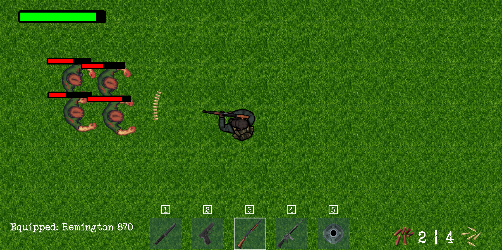

## Loot Drops
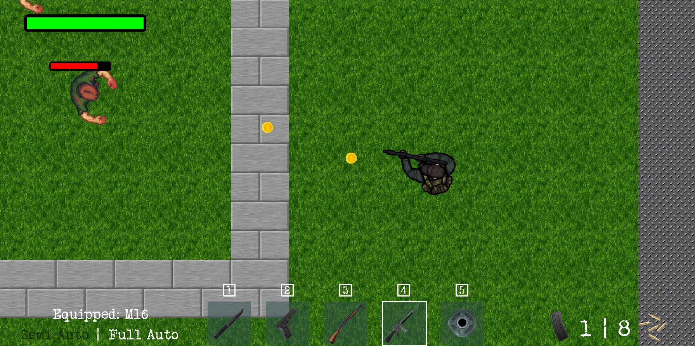

## Inventory
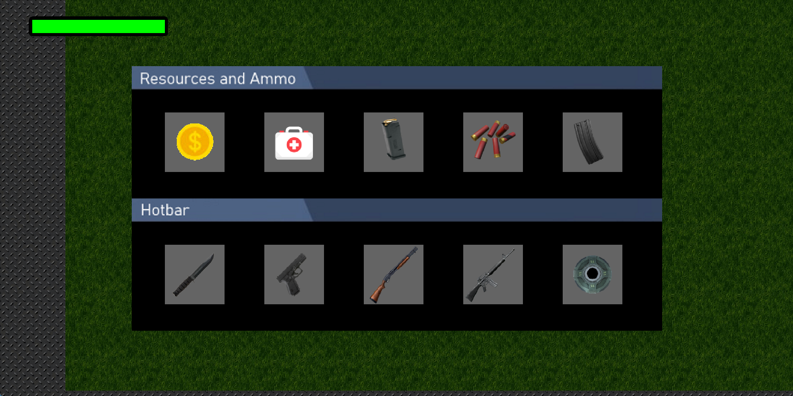

## Weapons
### KA-BAR (combat knife)
Swift and silent, the trusty KA-BAR is perfect for close-quarters combat. Sneak up on unsuspecting zombies and deliver swift, lethal strikes to eliminate them without attracting attention.
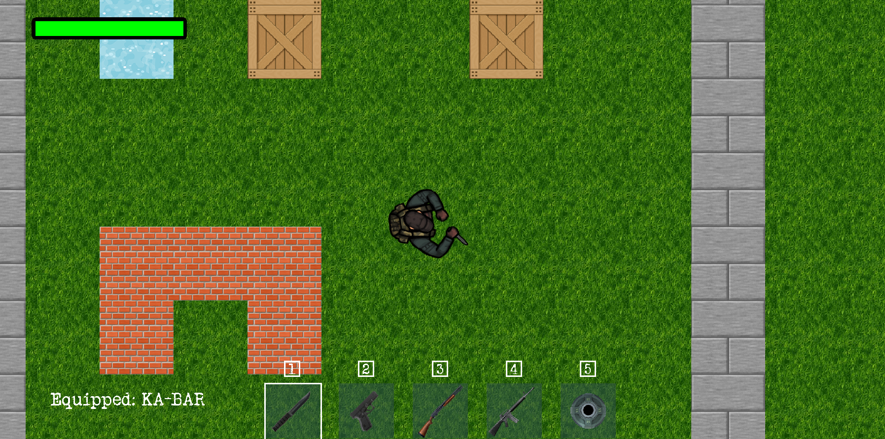

### Glock 19 (pistol)
A reliable sidearm that offers a balance of accuracy and firepower. Use it to dispatch zombies from a distance or as a backup when ammunition for heavier weapons runs low.
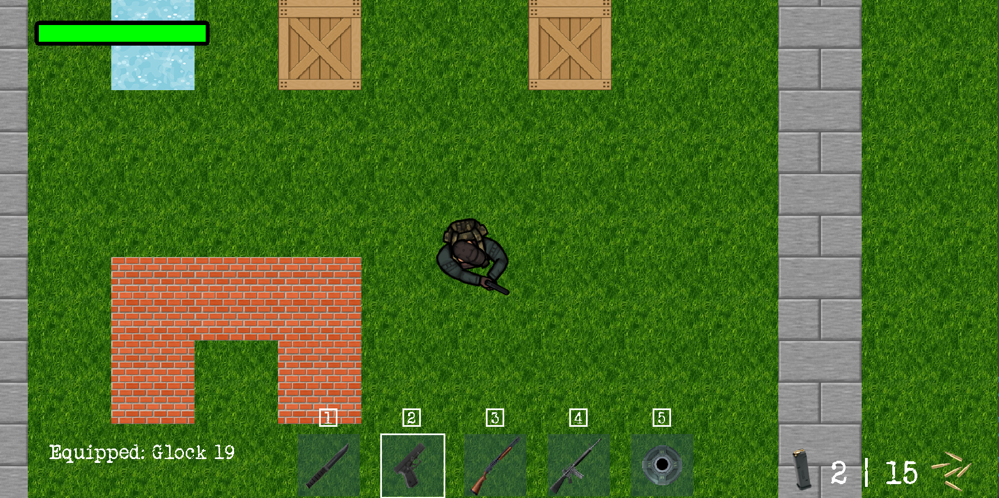

### Remington 870 (shotgun)
When the undead close in, the Remington 870 shotgun becomes your best friend. Its wide spread and high impact make it ideal for clearing out groups of zombies in one powerful blast.
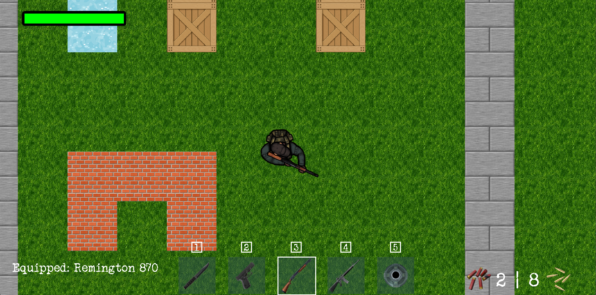

### M16 (assault rifle)
The M16 assault rifle is a versatile weapon that excels in medium-range combat. With its semi-automatic and fully automatic capabilities, it provides precision and rapid firepower to thin out the zombie hordes.

#### Semi-automatic
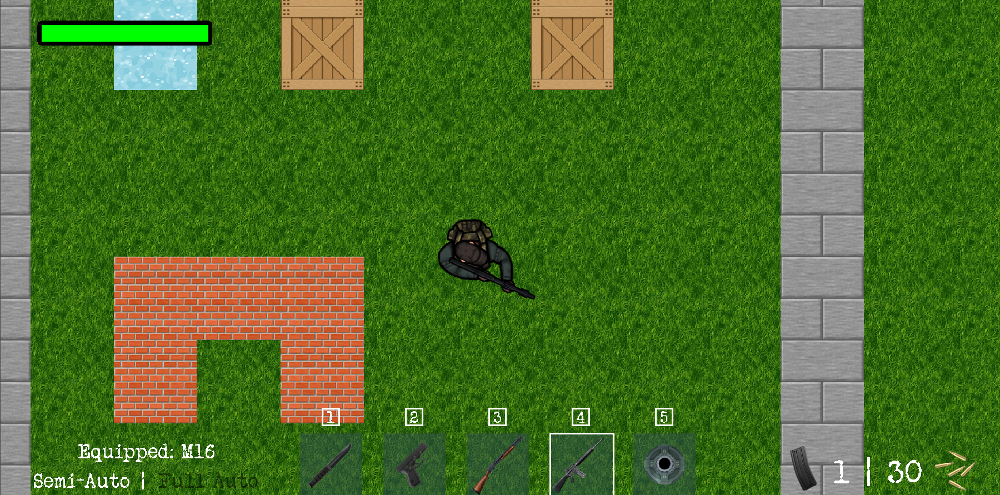

#### Fully automatic
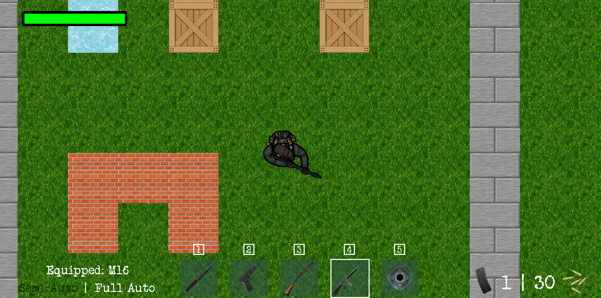

### Landmine (placeable explosive)
Set up traps and fortify your position with placeable landmines. Strategically plant them to surprise and eliminate approaching zombies, creating a temporary barrier of explosive protection.

## Reload
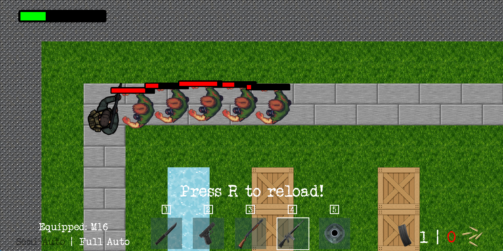

## Out of ammo
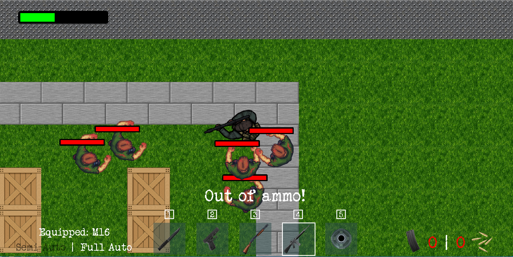

## Death screen
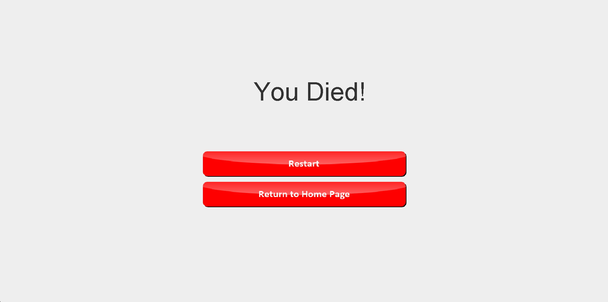
